# SANAD (سند)

**Evidence-based Shariah financial reasoning — powered entirely by Fanar AI models.**

SANAD is a production-grade **multi-agent platform** for Islamic finance and fiqh questions. It answers with **authenticated citations**, live market data, and **Fanar-Guard-2** safety — never generic hallucinated fatwas.

**Explainability chain:** Evidence → Principles → Reasoning → Final Analysis

Built for **Fanar Hackathon 2026** · QCRI

---

## Table of contents

1. [Project overview](#project-overview)
2. [Problem statement](#problem-statement)
3. [Why this problem matters](#why-this-problem-matters)
4. [Target users](#target-users)
5. [Key features](#key-features)
6. [AI capabilities](#ai-capabilities)
7. [Agentic workflow](#agentic-workflow)
8. [System architecture](#system-architecture)
9. [Frontend architecture](#frontend-architecture)
10. [Backend architecture](#backend-architecture)
11. [Database](#database)
12. [Authentication](#authentication)
13. [AI models used](#ai-models-used)
14. [Fanar integration](#fanar-integration)
15. [External models and services](#external-models-and-services)
16. [Retrieval pipeline](#retrieval-pipeline)
17. [Memory](#memory)
18. [Vector database](#vector-database)
19. [Security](#security)
20. [APIs](#apis)
21. [Folder structure](#folder-structure)
22. [Installation](#installation)
23. [Local development](#local-development)
24. [Production deployment](#production-deployment)
25. [Docker](#docker)
26. [Environment variables](#environment-variables)
27. [Evaluation](#evaluation)
28. [Screenshots and assets](#screenshots-and-assets)
29. [Known limitations](#known-limitations)
30. [Future work](#future-work)
31. [Lessons learned](#lessons-learned)
32. [Technology stack](#technology-stack)
33. [Documentation](#documentation)
34. [Testing](#testing)
35. [Integrity rules](#integrity-rules)

---

## Project overview

SANAD (**سند** — “support” or “evidence”) bridges contemporary financial instruments (ETFs, crypto, sukuk, digital-asset zakat) with classical and contemporary Islamic jurisprudence. The platform runs a **Plan → Execute → Verify** multi-agent pipeline where every answer must trace back to **reviewer-authenticated sources** or explicit refusal.

| Property | Value |
|----------|-------|
| **Stack** | Next.js 14 + FastAPI + PostgreSQL/pgvector + Redis |
| **AI** | Fanar models exclusively in the core pipeline |
| **Languages** | Arabic (RTL default) + English |
| **Deployment** | Docker Compose (dev + prod with Nginx) |
| **CI** | GitHub Actions — ruff, pytest, eslint, vitest, docker build |

---

## Problem statement

Muslims, scholars, and financial institutions need Shariah guidance on modern instruments, but:

- Global LLMs lack **Arabic fiqh terminology** and madhhab-aware reasoning
- Answers rarely cite **authenticated** Quran, Hadith, or AAOIFI sources
- Secular moderation blocks legitimate Islamic finance vocabulary
- Financial decisions require **both** live market data **and** jurisprudential analysis

**SANAD refuses to answer without evidence** and runs every output through **Fanar-Guard-2** (fail-closed).

---

## Why this problem matters

| Stakeholder | Value |
|-------------|-------|
| Scholars & researchers | Traceable evidence chain with per-step execution trace |
| Retail investors | AAOIFI company/portfolio screening + fiqh chat |
| Institutions | Source authentication workflow before RAG ingestion |
| Hackathon judges | Full Fanar model coverage with reproducible harness |

---

## Target users

- Islamic finance researchers and students
- Shariah advisors reviewing contemporary products
- Arabic-first users asking fiqh questions via text or voice
- Platform integrators via JWT-authenticated REST API

---

## Key features

| Feature | Route | Description |
|---------|-------|-------------|
| **Multi-agent chat** | `/chat` | Plan → Execute → Verify pipeline with SSE trace |
| **Company scanner** | `/scanner/company` | AAOIFI screening + Yahoo Finance + Fanar narrative |
| **Portfolio scanner** | `/scanner/portfolio` | Multi-holding Shariah analysis |
| **Zakat calculator** | `/tools/zakat` | Live gold/silver prices + fiqh guidance |
| **Document OCR** | `/documents` | Fanar-Oryx-IVU PDF/image extraction |
| **Voice chat** | `/chat` (mic) | Fanar-Aura STT → pipeline → TTS |
| **Evaluation harness** | `/evaluation` | Judge scenarios + demo prompts |
| **Knowledge graph** | `/knowledge-graph` | Optional Neo4j integration |
| **Scholar directory** | `/scholars` | Profiles with opinion samples |
| **Admin sources** | `/admin` | Reviewer-authenticated source CRUD |
| **Bilingual UI** | All pages | Arabic RTL + English LTR |

---

## AI capabilities

| Capability | Implementation | Fanar model |
|------------|----------------|-------------|
| Intent & entity extraction | `agents/intent_agent/` | Fanar-Sadiq |
| Grounded Islamic RAG | Fanar API + pgvector hybrid | Fanar-Sadiq |
| Deep fiqh reasoning | Takyeef Fiqhi with thinking mode | Fanar-C-2-27B |
| Fast factual answers | Short-circuit reasoning path | Fanar-Sadiq |
| Safety moderation | Input + output, fail-closed | Fanar-Guard-2 |
| Embeddings | Batch vector generation | Fanar |
| Translation | Answer + evidence alignment | Fanar-Shaheen-MT-1 |
| Speech input/output | Voice chat + tools API | Fanar-Aura-STT-1 / TTS-2 |
| Document vision/OCR | PDF upload + document Q&A | Fanar-Oryx-IVU-2 |
| Agentic planning | JSON execution plan (deep mode) | Fanar-Sadiq (agentic role) |

---

## Agentic workflow

**Plan → Execute → Verify** in `backend/app/agents/agent_orchestrator.py`:

```
Intent → Retrieval → Knowledge → Financial → Reasoning → Verification → Response
```

| Agent | Role | Primary model |
|-------|------|---------------|
| Intent | Language, entities, domain | Fanar-Sadiq |
| Retrieval | Fanar-Sadiq RAG + pgvector + optional web | Fanar-Sadiq |
| Knowledge | Evidence bundle + fiqh principles | Fanar-Sadiq |
| Financial | Live quotes, AAOIFI context | External APIs |
| Reasoning | Takyeef Fiqhi analysis | Fanar-C-2-27B (deep) |
| Verification | Citations + Guard | Fanar-Guard-2 |
| Response Builder | Structured FinalResponse | Analysis passthrough |

Click **View Execution Trace** on any chat answer to see models, latency, and tokens per step.

**Details:** [docs/AGENTS.md](docs/AGENTS.md) · [docs/AI_PIPELINE.md](docs/AI_PIPELINE.md)

---

## System architecture

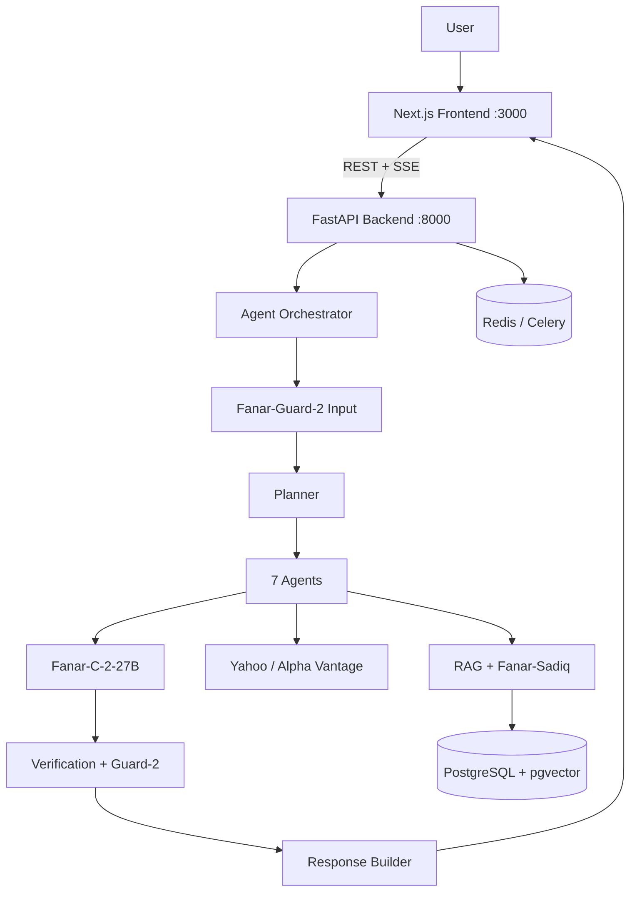

Production adds **Nginx** (:80) in front of frontend and backend. See [docs/ARCHITECTURE.md](docs/ARCHITECTURE.md).

---

## Frontend architecture

| Layer | Path | Technology |
|-------|------|------------|
| App Router pages | `frontend/src/app/` | Next.js 14 file-based routing |
| Feature modules | `frontend/src/features/` | Chat, scanner, documents, scholars, … |
| API clients | `frontend/src/services/` | Typed wrappers over `/api/v1` |
| State | `frontend/src/store/` | Zustand (auth, conversations, settings) |
| UI primitives | `frontend/src/components/ui/` | Shadcn + Radix |
| i18n | `frontend/src/lib/` | Arabic RTL / English LTR |
| Proxy | `next.config.mjs` | Rewrites `/api/*` → backend |

**Auth guards:** `AuthGuard`, `AdminGuard`, `OnboardingGuard`, `RedirectIfAuthenticated`.

**Key flows:**
- Chat submits `POST /queries`, polls `GET /queries/{id}/stream` (SSE)
- JWT in `localStorage` via `authStore`; all API calls send `Authorization: Bearer`
- Conversation store scoped to `ownerUserId` to prevent cross-user leaks

See [frontend/README.md](frontend/README.md).

---

## Backend architecture

| Layer | Path | Role |
|-------|------|------|
| Entry | `backend/app/main.py` | FastAPI factory, CORS, 15 routers |
| API | `backend/app/api/` | REST endpoints under `/api/v1` |
| Services | `backend/app/services/` | Business logic (~41 modules) |
| Orchestrator | `backend/app/agents/agent_orchestrator.py` | Multi-agent pipeline |
| Agents (logic) | `agents/` | Pure agent implementations |
| RAG | `rag/` + `backend/app/rag/` | Pipeline + backend connector |
| Models | `backend/app/models/` | SQLAlchemy ORM |
| Repositories | `backend/app/repositories/` | Data access |
| Workers | `backend/app/workers/` | Celery (stub tasks; queries use BackgroundTasks) |

Fanar HTTP calls are centralized in `agents/common/fanar_client.py`. Model routing: `backend/app/services/fanar_model_router.py`.

---

## Database

**PostgreSQL 16 + pgvector** — users, queries, responses, authenticated sources, vector chunks, user documents, audit logs.

- Embeddings: **VECTOR(3584)** (Fanar embedding model)
- Migrations: Alembic `001`–`007` in `alembic/versions/`
- Optional: Neo4j for knowledge graph when configured

**Full schema:** [docs/DATABASE.md](docs/DATABASE.md)

---

## Authentication

| Mechanism | Implementation |
|-----------|----------------|
| **JWT** | HS256 via `python-jose`; `Authorization: Bearer` |
| **Passwords** | bcrypt via `passlib` |
| **RBAC** | `user` / `reviewer` / `admin` roles |
| **SSO** | Google + Microsoft OAuth; demo mode when secrets absent |
| **Platform API** | `X-Platform-Key` header for B2B endpoints |
| **Isolation** | All queries scoped by `user_id` |

Routes: `POST /auth/register`, `/auth/login`, `GET /auth/me`, SSO under `/auth/sso/*`.

---

## AI models used

All models configured in `config/fanar_api_keys.py`. No OpenAI/Anthropic in the core pipeline.

### Fanar-Sadiq

| | |
|---|---|
| **Purpose** | Intent, RAG, fast reasoning, knowledge extraction, response formatting, planner |
| **Why chosen** | Grounded Islamic content retrieval; native Arabic generation; low latency |
| **Inputs** | Chat messages, retrieval queries, evidence bundles |
| **Outputs** | Text, JSON structures, Quran/Hadith/fatwa reference objects |
| **Limitations** | No native SSE streaming in current integration; JSON can be malformed on complex schemas |

### Fanar-C-2-27B

| | |
|---|---|
| **Purpose** | Deep Takyeef Fiqhi analysis, madhhab comparison |
| **Why chosen** | Correct Arabic fiqh terminology; `<thinking>` mode for complex queries |
| **Inputs** | Evidence + principles + financial context + fiqh system prompt |
| **Outputs** | JSON: `analysis`, `reasoning_steps`, `opinions`, `madhhab_matrix` |
| **Limitations** | Higher latency; occasional JSON parse fallbacks |

### Fanar-Guard-2

| | |
|---|---|
| **Purpose** | Input screening + output moderation |
| **Why chosen** | Cultural awareness scores for Islamic finance discourse |
| **Inputs** | `prompt` + `response` (input guard uses placeholder for empty response) |
| **Outputs** | `safety`, `cultural_awareness` scores (0–1) |
| **Limitations** | Requires non-empty response field; fail-closed after 3 retries if API down |

### Fanar (embeddings)

| | |
|---|---|
| **Purpose** | Semantic search over authenticated source chunks |
| **Why chosen** | Matches Fanar RAG ecosystem; 3584-dim vectors |
| **Inputs** | Text batches via `POST /v1/embeddings` |
| **Outputs** | Float vectors stored in pgvector |
| **Limitations** | Network latency on large ingestion batches |

### Fanar-Shaheen-MT-1

| | |
|---|---|
| **Purpose** | UI translation; optional cross-language retrieval |
| **Why chosen** | Arabic-centric MT for ar/en/fr/ur/tr/ms |
| **Inputs** | Source/target language + text |
| **Outputs** | Translated text |
| **Limitations** | Inline Quran/Hadith citation markers may lose formatting |

### Fanar-Aura-STT-1 / Fanar-Aura-TTS-2

| | |
|---|---|
| **Purpose** | Voice chat input and answer playback |
| **Why chosen** | Strong Arabic dialect recognition for Islamic finance terms |
| **Inputs** | Audio multipart (STT); text (TTS) |
| **Outputs** | Transcript / audio/mpeg |
| **Limitations** | No real-time partial STT in current UI |

### Fanar-Oryx-IVU-2

| | |
|---|---|
| **Purpose** | PDF/image OCR for document upload and document Q&A |
| **Why chosen** | RTL table extraction for AAOIFI reports |
| **Inputs** | PDF/image bytes |
| **Outputs** | Extracted text + structured elements |
| **Limitations** | Local Docling fallback used when vision API unavailable |

---

## Fanar integration

**Where Fanar is used:** Every AI step — from input guard through retrieval, reasoning, output guard, voice, vision, translation, and embeddings.

**Why Fanar (vs general LLMs):**

| Need | Fanar advantage observed in SANAD |
|------|-----------------------------------|
| Arabic fiqh vocabulary | C-2 + Sadiq use correct *Takyeef*, *Qawa'id*, madhhab framing |
| Grounded Islamic RAG | Sadiq returns citable Quran/Hadith/fatwa excerpts |
| Cultural safety | Guard-2 scores `cultural_awareness` — secular guards over-block fiqh terms |
| Arabic voice | Aura STT handles Gulf/Levantine dialects for finance vocabulary |
| RTL documents | Oryx IVU extracts Arabic financial tables |

**Strengths observed:** See [FANAR_INSIGHTS.md](FANAR_INSIGHTS.md)

**Weaknesses observed & recommendations:**

1. No native SSE streaming → request Fanar-Sadiq streaming endpoint
2. Complex fiqh JSON occasionally malformed → fiqh JSON schema mode
3. Separate Guard calls per section → batch moderation endpoint
4. Translation drops citation markers → citation-preserving MT mode

**Full integration map:** [docs/FANAR_INTEGRATION.md](docs/FANAR_INTEGRATION.md)

**API reference:** [docs/reference/fanar-openapi.json](docs/reference/fanar-openapi.json)

---

## External models and services

These are **not LLMs** — they supplement the Fanar pipeline:

| Service | Purpose | Config |
|---------|---------|--------|
| Yahoo Finance | Stock quotes, company fundamentals | Built-in via `yfinance` |
| Alpha Vantage | Market data fallback | `ALPHA_VANTAGE_API_KEY` |
| Serper / Tavily / LangSearch | Optional web retrieval enrichment | `SERPER_API_KEY`, etc. |
| Neo4j | Optional knowledge graph | `NEO4J_URI` |
| Docling (local) | PDF text extraction fallback | `backend/app/tools/docling-main/` |

AAOIFI screening rules run in deterministic Python (`scanner_service.py`) — not an LLM.

---

## Retrieval pipeline

Module: `rag/pipelines/retrieval_pipeline.py`

1. **Ingest** — authenticated sources only (reviewer workflow)
2. **Chunk** — semantic splits (~800 tokens, 120 overlap)
3. **Embed** — Fanar `POST /v1/embeddings`
4. **Store** — PostgreSQL pgvector
5. **Retrieve** — dual path: Fanar-Sadiq API + local hybrid (vector + keyword)
6. **Rerank** — lexical overlap + score fusion (`cross_encoder_reranker.py`)
7. **Diversity filter** — reduce redundant chunks
8. **Metadata filter** — `authenticated_only=True`

Empty evidence → **refusal** with explicit reason.

---

## Memory

| Layer | Implementation |
|-------|----------------|
| **Session** | Client `session_id` on queries; indexed in PostgreSQL |
| **Server turns** | `conversation_memory_service.py` — prior Q&A per `(user_id, session_id)` |
| **Follow-ups** | Regex patterns (AR/EN) + optional Fanar query rewrite |
| **Evidence reuse** | Prior response evidence re-injected for “list all adilla” follow-ups |
| **Document memory** | OCR'd upload text in retrieval context |
| **Client cache** | Zustand store scoped to `ownerUserId` |

Tuning: `MAX_EVIDENCE_TOKENS`, `MAX_TURN_CHARS`, `MAX_PROMPT_HISTORY_CHARS`.

---

## Vector database

| Aspect | Detail |
|--------|--------|
| **Engine** | PostgreSQL 16 + **pgvector** (not a separate vector DB) |
| **Table** | `source_chunks.embedding` — **VECTOR(3584)** |
| **Similarity** | Cosine distance via SQLAlchemy |
| **Embeddings model** | Fanar (`config/fanar_api_keys.py` → `"embedding": "Fanar"`) |
| **Reranking** | Lexical overlap reranker + diversity filter (local Python, not neural cross-encoder) |
| **Filter** | Only `is_authenticated=true` sources enter retrieval |

Client: `rag/vectorstore/pgvector_client.py` · Generator: `rag/embeddings/fanar_embedding_model.py`

---

## Security

| Control | Implementation |
|---------|----------------|
| Authentication | JWT + bcrypt |
| User isolation | All queries/conversations scoped by `user_id` |
| Input guard | Fanar-Guard-2 before pipeline |
| Output guard | Fanar-Guard-2 + citation rules |
| Fail-closed | Guard API failure → reject response |
| RBAC | user / reviewer / admin roles |
| Secrets | `.env` only — never commit; see `.env.example` |
| CORS | Configurable via `CORS_ORIGINS` |

---

## APIs

Base URL: `/api/v1` · Live spec: http://localhost:8000/api/v1/docs

| Group | Key endpoints |
|-------|-------------|
| Health | `GET /health`, `/health/ready`, `/version` |
| Auth | `POST /auth/register`, `/auth/login`, `GET /auth/me` |
| Queries | `POST /queries`, `GET /queries/{id}/stream` (SSE), export |
| Tools | `/tools/transcribe`, `/translate`, `/tts`, `/scanner/*`, `/documents/*` |
| Knowledge | `GET /knowledge/sources`, `/knowledge/graph` |
| Admin | `GET /admin/stats`, CRUD `/sources` |
| Evaluation | `GET /evaluation/dashboard`, `/evaluation/harness` |
| Platform | `POST /platform/queries` (requires `X-Platform-Key`) |

**Overview:** [docs/API.md](docs/API.md)

---

## Folder structure

```
agents/          Multi-agent pipeline (pure Python)
backend/app/     FastAPI API + services + orchestrator
rag/             RAG ingestion, embeddings, retrieval, rerankers
frontend/src/    Next.js UI (App Router + features)
config/          Fanar model registry (fanar_api_keys.py)
alembic/         Database migrations (001–007)
tests/           Backend + frontend test suites
docs/            Documentation hub
scripts/         start / stop / verify / deploy
deploy/nginx/    Production reverse proxy
archive/         Non-runtime artifacts
archive/         Non-runtime artifacts
```

**Full map:** [docs/FOLDER_STRUCTURE.md](docs/FOLDER_STRUCTURE.md)

---

## Installation

### Prerequisites

- Docker 24+ and Docker Compose v2
- **Fanar API key** — [Fanar](https://fanar.qa)
- Node.js 20+ (local frontend dev only)
- Python 3.11+ (local backend dev only)

### Quick start (Docker — recommended)

```bash
git clone <repository-url>
cd SANAD
cp .env.example .env
# Edit .env — minimum: FANAR_API_KEY=your-key
```

**Windows:**

```powershell
.\scripts\start-sanad.ps1
# First time or after updates:
.\scripts\start-sanad.ps1 -Rebuild
```

**Linux/macOS:**

```bash
docker compose up -d
```

| URL | Purpose |
|-----|---------|
| http://localhost:3000/welcome | Landing page |
| http://localhost:3000/chat | Chat (register/login first) |
| http://localhost:3000/evaluation | **Judge dashboard** |
| http://localhost:8000/api/v1/docs | OpenAPI specification |

**Verify:**

```powershell
.\scripts\verify-sanad.ps1
```

> Use Docker **or** local dev servers — not both on ports 3000/8000.

---

## Local development

See [docs/DEVELOPMENT.md](docs/DEVELOPMENT.md).

```bash
# Backend
cp .env.example .env
pip install -r requirements.txt
alembic upgrade head
export PYTHONPATH=.
uvicorn backend.app.main:app --reload --port 8000

# Frontend (separate terminal)
cd frontend && cp .env.example .env.local && npm install && npm run dev
```

Set `NEXT_PUBLIC_API_URL=http://localhost:8000` in `frontend/.env.local`.

---

## Production deployment

```bash
docker compose -f docker-compose.prod.yml --env-file .env up -d --build
```

Requires strong `JWT_SECRET`, `POSTGRES_PASSWORD`, and `FANAR_API_KEY`.

See [docs/DEPLOYMENT.md](docs/DEPLOYMENT.md).

---

## Docker

| File | Purpose |
|------|---------|
| `docker-compose.yml` | Dev: Postgres, Redis, backend, Celery, frontend |
| `docker-compose.prod.yml` | Prod: + Nginx reverse proxy |
| `Dockerfile` | Backend Python image |
| `frontend/Dockerfile` | Next.js standalone image |
| `deploy/nginx/nginx.conf` | SSE-friendly proxy (900s timeout) |

Backend container runs `alembic upgrade head` on start.

---

## Environment variables

Copy `.env.example` → `.env`. Never commit secrets.

| Variable | Required | Description |
|----------|----------|-------------|
| `FANAR_API_KEY` | **Yes** | Fanar API authentication |
| `FANAR_API_BASE_URL` | No | Default `https://api.fanar.qa/v1` |
| `FANAR_ORGANIZATION` | No | Default `QCRI-Hackathon` |
| `JWT_SECRET` | **Yes (prod)** | JWT signing secret |
| `POSTGRES_PASSWORD` | **Yes (prod)** | Database password |
| `DATABASE_URL` | Dev | Async SQLAlchemy URL |
| `REDIS_URL` | No | Celery/cache |
| `CORS_ORIGINS` | No | JSON list of allowed origins |
| `FANAR_GUARD_MIN_SAFETY` | No | Default 0.7 |
| `FANAR_GUARD_MIN_CULTURAL` | No | Default 0.7 |
| `SKIP_AGENTIC_PLANNER` | No | Disable JSON planner |
| `ENABLE_CROSS_LANGUAGE_RETRIEVAL` | No | Default false |
| `NEO4J_URI` | No | Optional knowledge graph |
| `SSO_DEMO_MODE` | No | Demo OAuth without credentials |
| `NEXT_PUBLIC_API_URL` | Frontend | Empty in prod (same-origin) |

**Full reference:** [docs/CONFIGURATION.md](docs/CONFIGURATION.md)

---

## Evaluation

For hackathon judges:

1. Open http://localhost:3000/evaluation
2. Run demo scenarios — each maps to Fanar capabilities
3. Inspect **execution trace** on chat answers
4. API harness: `GET /api/v1/evaluation/harness`

**Sample queries:**

- *Is riba haram in Islam?* (fast Fanar-Sadiq path)
- *Compare scholarly opinions on Bitcoin staking* (deep Fanar-C-2-27B)
- *ما حكم تأخير الزكاة؟* (Arabic reasoning)
- Company scanner: `TSLA` (AAOIFI + market data)

**Guide:** [docs/EVALUATION.md](docs/EVALUATION.md)

---

## Screenshots and assets


### Welcome
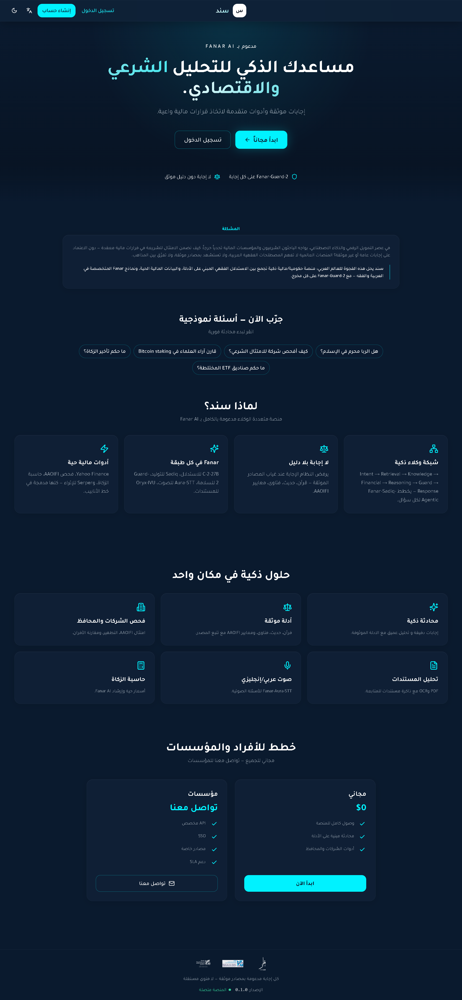

### Login
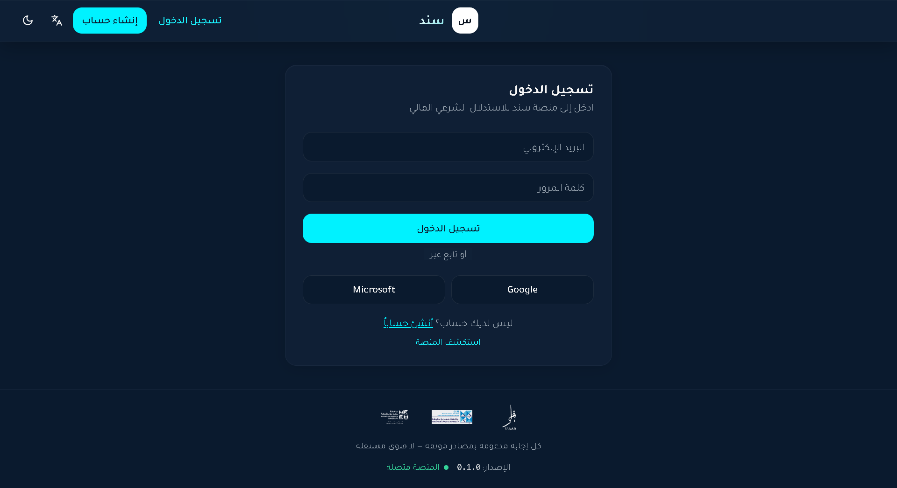

### Register
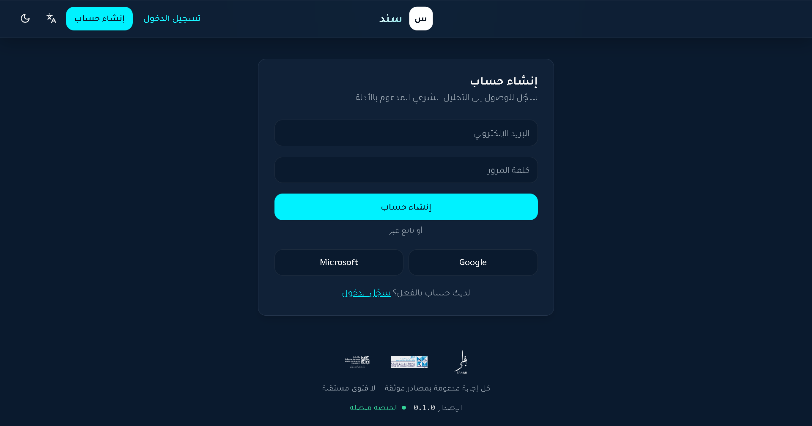

### Chat Interface
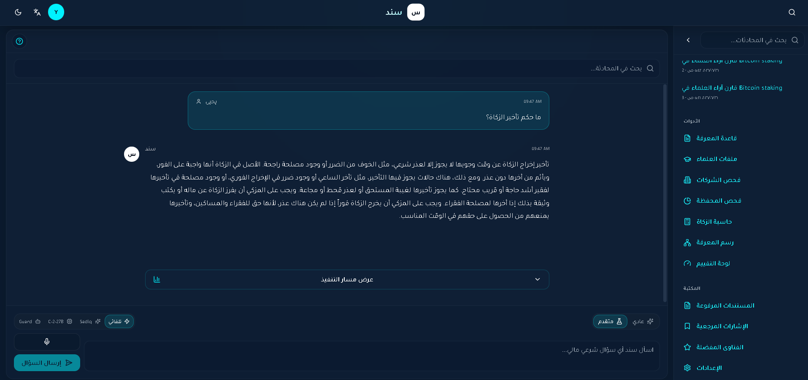

### Company Scanner
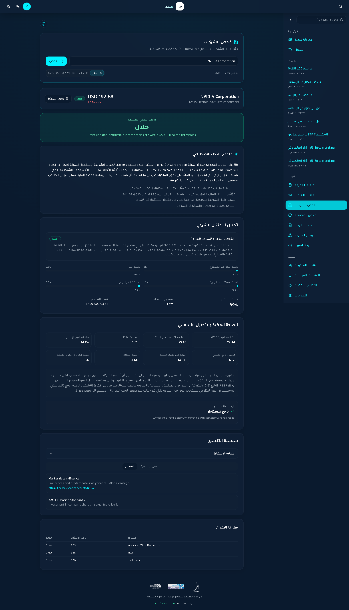

### Portfolio Scanner
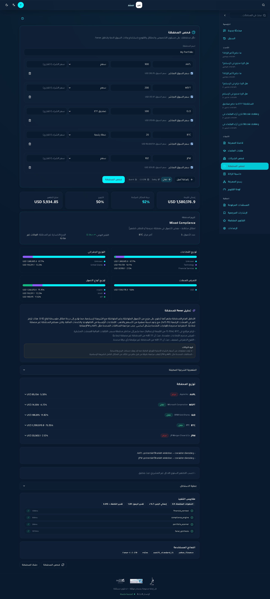

### Zakat Calculator
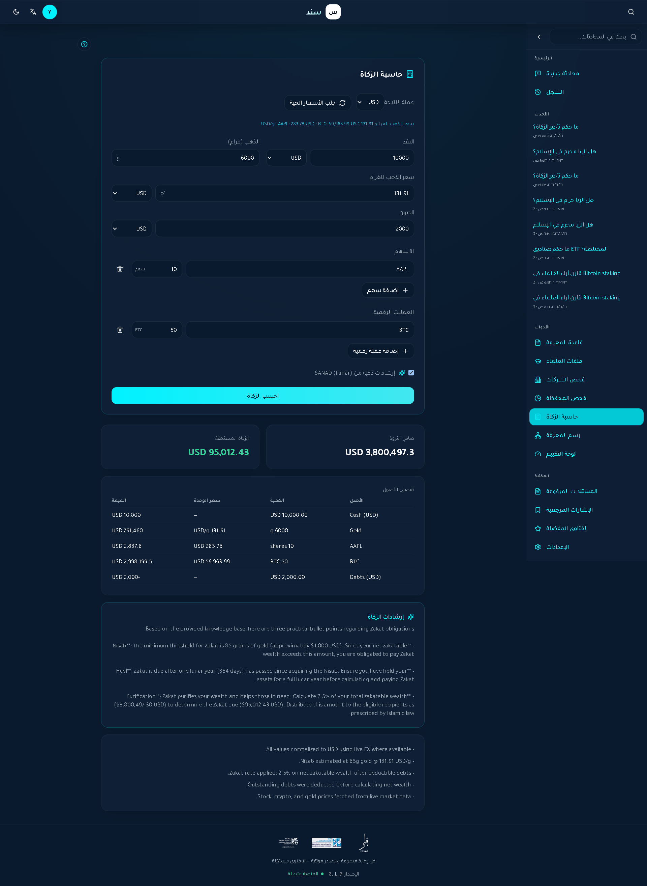

### Document OCR
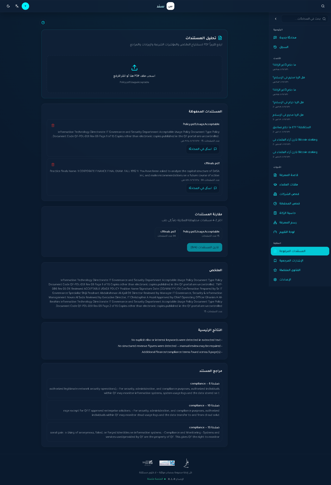

### Knowledge Graph
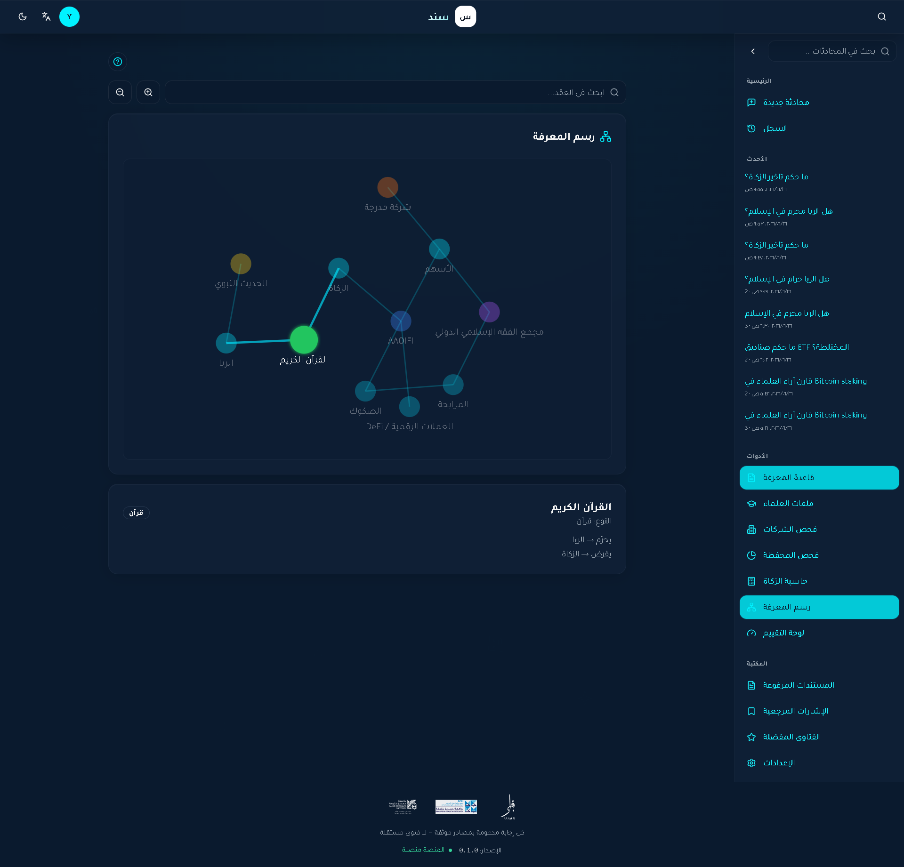

### Evaluation Harness
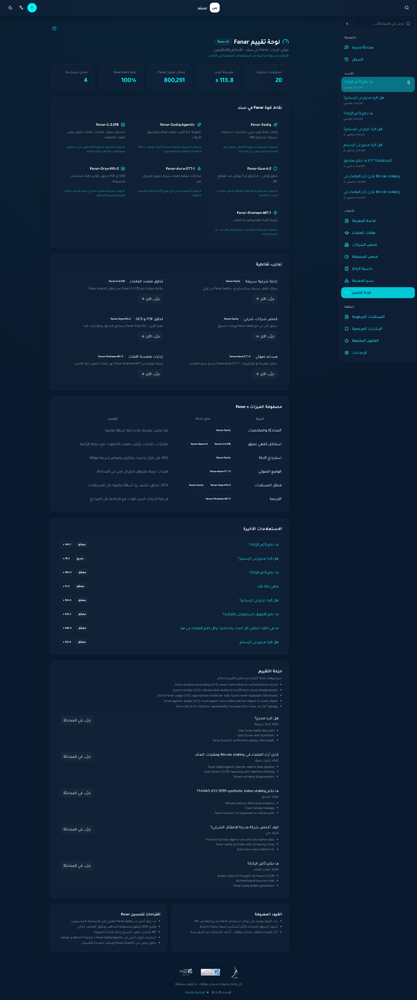

### Settings
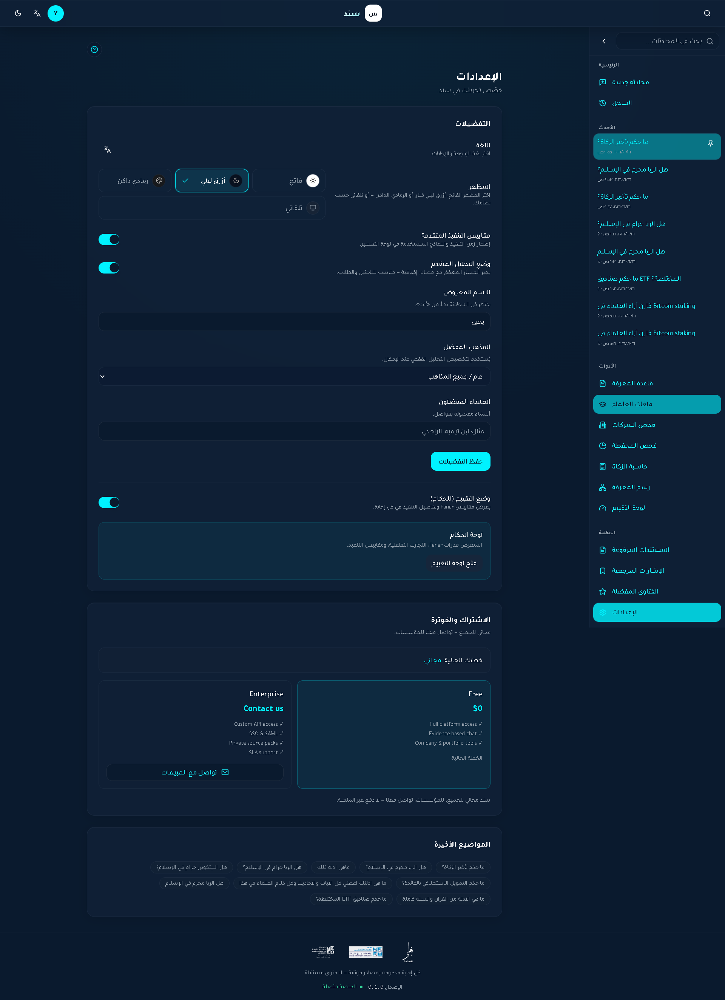

Icons: `frontend/public/icons/` (Fanar2.svg, QCRI.svg, hbku.svg, PWA icons).

---

## Known limitations

- Chat pipeline is **slower** than scanner tools (7 agents vs 1 Fanar call) — by design for evidence integrity
- No native Fanar SSE streaming yet — UI uses backend SSE status events
- Cross-language retrieval disabled by default (`ENABLE_CROSS_LANGUAGE_RETRIEVAL=false`)
- Neo4j knowledge graph requires separate Neo4j instance
- Large vendored folder `backend/app/tools/docling-main/` increases clone size
- Fanar-Guard requires non-empty `response` field on moderation API (placeholder used for input screening)
- Celery tasks are stubs; async queries use FastAPI `BackgroundTasks`
- `FlagEmbedding-master/` and `Qwen3-Embedding-main/` under `backend/app/tools/` are **not imported** (legacy copies)

---

## Future work

- Fanar native streaming for chat UX
- Batch Fanar-Guard moderation
- Structured fiqh JSON schema from Fanar-C-2
- Agentic tool calls to market data APIs via Fanar
- Slim Docker image without vendored Docling
- Mobile apps (out of current scope — see [PRD.md](PRD.md))

See [FANAR_INSIGHTS.md](FANAR_INSIGHTS.md).

---

## Lessons learned

1. **Evidence-first architecture** beats speed for fiqh use cases — users trust refusals over hallucinations
2. **Fanar-Guard cultural scores** are essential — secular guards over-block Islamic finance terms
3. **Shared FanarLLMClient** with connection pooling prevents HTTP leaks under concurrent requests
4. **User-scoped conversation storage** must be enforced on both client (localStorage) and server (DB)
5. **Separate fast paths** (scanner) from deep agent pipeline — judges compare both intentionally

---

## Technology stack

| Category | Technology |
|----------|------------|
| **Frontend** | Next.js 14, React 18, TypeScript, Tailwind CSS 3, Radix UI, Shadcn |
| **State / UX** | Zustand, Framer Motion, next-themes, Three.js (knowledge graph) |
| **Backend** | FastAPI, Python 3.11, Pydantic v2, SQLAlchemy 2 async, uvicorn |
| **Database** | PostgreSQL 16 |
| **Vector DB** | pgvector extension (3584-dim Fanar embeddings) |
| **Cache / queue** | Redis, Celery |
| **AI models** | Fanar-Sadiq, Fanar-C-2-27B, Fanar-Guard-2, Fanar-Shaheen-MT-1, Fanar-Aura-STT-1, Fanar-Aura-TTS-2, Fanar-Oryx-IVU-2, Fanar embeddings |
| **Embeddings** | Fanar API → pgvector |
| **Reranker** | Lexical overlap + diversity reranker (`rag/rerankers/`) |
| **Speech** | Fanar-Aura-STT-1, Fanar-Aura-TTS-2 |
| **OCR / vision** | Fanar-Oryx-IVU-2 (+ optional Docling local fallback) |
| **Market data** | Yahoo Finance (`yfinance`), Alpha Vantage |
| **Web search** | Serper, Tavily, LangSearch (optional) |
| **Graph DB** | Neo4j (optional) |
| **Authentication** | JWT (python-jose), bcrypt, OAuth SSO |
| **Infrastructure** | Docker, Docker Compose, Nginx |
| **Hosting** | Self-hosted via Docker Compose (no cloud lock-in) |
| **DevOps / CI** | GitHub Actions — ruff, pytest, eslint, vitest, docker build |
| **Testing** | pytest, pytest-asyncio, Vitest, Testing Library |
| **Migrations** | Alembic |
| **Linting** | ruff (Python), ESLint (TypeScript) |

---

## Documentation

| Document | Description |
|----------|-------------|
| [docs/README.md](docs/README.md) | Documentation index |
| [docs/ARCHITECTURE.md](docs/ARCHITECTURE.md) | System design |
| [docs/AGENTS.md](docs/AGENTS.md) | Agent pipeline |
| [docs/AI_PIPELINE.md](docs/AI_PIPELINE.md) | RAG + memory + external services |
| [docs/FANAR_INTEGRATION.md](docs/FANAR_INTEGRATION.md) | Fanar model map |
| [docs/API.md](docs/API.md) | REST API overview |
| [docs/DATABASE.md](docs/DATABASE.md) | PostgreSQL schema |
| [docs/DEVELOPMENT.md](docs/DEVELOPMENT.md) | Local dev guide |
| [docs/CONFIGURATION.md](docs/CONFIGURATION.md) | Environment variables |
| [docs/DEPLOYMENT.md](docs/DEPLOYMENT.md) | Production Docker |
| [docs/EVALUATION.md](docs/EVALUATION.md) | Judge guide |
| [docs/FOLDER_STRUCTURE.md](docs/FOLDER_STRUCTURE.md) | Repository layout |
| [FANAR_INSIGHTS.md](FANAR_INSIGHTS.md) | Fanar strengths & feature requests |
| [PRD.md](PRD.md) | Product requirements |
| [docs/archive/](docs/archive/) | Superseded historical docs |

---

## Testing

```bash
# Backend (requires Postgres + pgvector)
export PYTHONPATH=.
pytest tests/ -q

# Frontend
cd frontend && npm test

# Full script (Windows)
.\scripts\run_tests.ps1
```

CI workflow: `.github/workflows/ci.yml` (runs on push to `main` / `develop`).

---

## Integrity rules

1. **No hallucination** — refuse without authenticated sources
2. **Mandatory citations** — every claim traceable to evidence
3. **Human oversight** — reviewers authenticate sources before RAG
4. **Fanar-Guard-2 always** — fail-closed on input and output

---

## Before uploading to GitHub

Ensure the repository is clean and safe to publish:

| Check | Action |
|-------|--------|
| **Secrets** | Never commit `.env` — only `.env.example` (already in `.gitignore`) |
| **Cache dirs** | Remove `.pytest_cache/`, `.mypy_cache/`, `.ruff_cache/`, `.vite/`, `frontend/.next/` (regenerated on build) |
| **Dependencies** | `node_modules/` is gitignored — run `npm install` after clone |
| **Fanar key** | Set `FANAR_API_KEY` locally only |
| **Large vendored trees** | Optional sparse checkout: `backend/app/tools/docling-main/` (~3800 files) |

```powershell
# Initialize and first commit 
git init
git add .
git status   # verify .env is NOT listed
git commit -m "SANAD: Fanar Hackathon 2026 submission"
git remote add origin <https://github.com/yahyaelnamla/SANAD>
git push -u origin main
```

---

## License

MIT — see [LICENSE](LICENSE).

---

**Built for Fanar Hackathon 2026 · SANAD (سند) — your evidence-backed Shariah reasoning platform**
